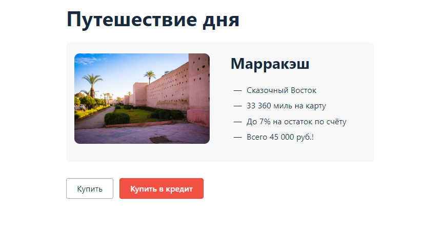
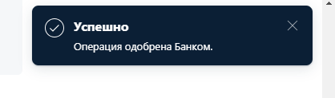
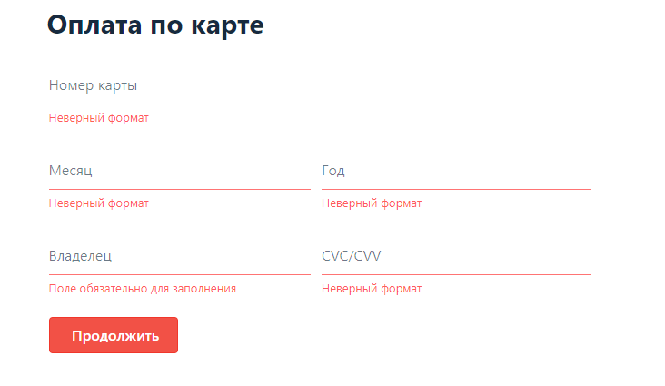
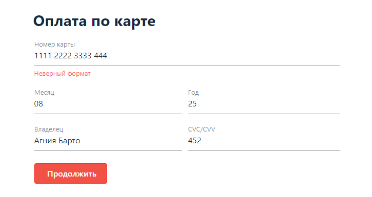
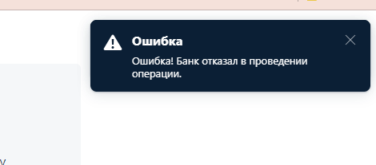
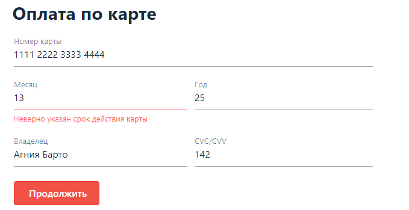
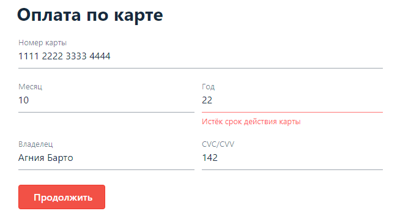
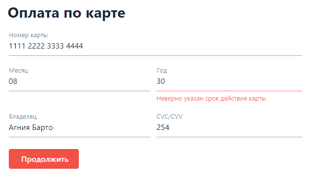
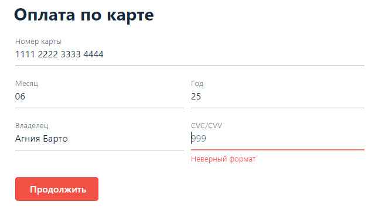

# Планирование автоматизации тестирования
## 1. Перечень автоматизируемых сценариев
*Предусловие:* Открыта приложение/веб сервис покупки тура по 2 размым методам по адресу http://localhost:8080 и нажать на выбранный метод оплаты.

**TK 01 Заполнение способа оплаты валидными данными (happy path)**
* Поле "Номер карты"
Валидные данные: 16 арабских цифр 1111 2222 3333 4444 для успешных операций, 5555 6666 7777 8888 для не успешных операций
* Поле "Месяц"
Валидные данные: номер из арабских цифр от 1 до 12
* Поле "Год"
Валидные данные: последние 2 цифры данного год и выше, максимум +5 лет
* Поле "Владелец"
Валидные данные: кириллица, латиница, пробел, дефис, точка от 2 букв имя и фамилия(например Иван-Сергей Иванов, Ivan Sergeyev-Ivanov, А. Иванов)
* Поле "CVC/CVV"
Валидные данные: Число из 3 арабских цифр (например 854)

* ТК 01 ### **Отправка формы заполненной валидными данными, карта 1111 2222 3333 4444, форма Купить** 
1. Нажать на кнопку "Купить"
2. Заполнить поле "Номер карты" значением 1111 2222 3333 4444
3. Заполнить остальные поля валидными данными
4. Нажимаем кнопку "Продолжить"
5. Сделать запрос из таблицы payment_entity статус последней операции.

*Ожидаемый результат*: форма отправлена, всплывает окно с сообщение "Успешно", в таблице операция со статусом APPROVED.

* ТК 02 ### **Отправка формы заполненной валидными данными, карта 5555 6666 7777 8888, форма Купить** 
1. Нажать на кнопку "Купить"
2. Заполнить поле "Номер карты" значением 5555 6666 7777 8888
3. Заполнить остальные поля валидными данными
4. Нажимаем кнопку "Продолжить"
5. Сделать запрос из таблицы payment_entity статус последней операции

*Ожидаемый результат*: форма отправлена, всплывает окно с сообщение "Ошибка", в таблице операция со статусом DECLINED.

* ### **Оплата с  невалидными данными**

** TK 03 Пустые поля**
1. Оставить все поля незаполненными
2. Нажать на кнопку “Продолжить”

*Ожидаемый результат:* Сообщение об ошибке под всеми полями “Неверный формат” и "Поле обязательно для заполнения"

* ###TK 04 **Оплата с невалидными данными в поле “Номер карты" (меньше 16 цифр)**
1. Заполнить поле "Номер карты" 15 цифрами 
2. Остальные поля заполнить валидными данными
3. Нажать кнопку “Продолжить”

*Ожидаемый результат:* Сообщение об ошибке "Неверный формат" под полем "Номер карты" 

* ### TK 05 **Оплата с невалидными данными в поле “Номер карты" (все нули)**
1. Заполнить поле "Номер карты" 16 нулями
2. Остальные поля заполнить валидными данными
3. Нажать кнопку “Продолжить”

*Ожидаемый результат:* Сообщение об ошибке "Ошибка, Банк отказал в проведении операции"

* ### TK 06**Оплата с невалидными данными в поле "Месяц"(цифра больше 12)**
1. Заполнить в поле "Месяц" цифру 13
2. Остальные поля заполнить валидными данными
3. Нажать кнопку “Продолжить”

*Ожидаемый результат:* Сообщение об ошибке "Неверно указан срок действия карты" под полем "Месяц"

* ### TK 07  **Оплата с невалидными данными в поле "Месяц"(два нуля)**
1. Заполнить в поле "Месяц" цифру 00
2. Остальные поля заполнить валидными данными
3. Нажать кнопку “Продолжить”

*Ожидаемый результат:* Сообщение об ошибке "Неверно указан срок действия карты" под полем "Месяц"

* ### TK 08 **Оплата с невалидными данными в поле "Год"(прошедшая дата)**
1. Заполнить в поле "Год" прошедшую дату (например 22)
2. Остальные поля заполнить валидными данными
3. Нажать кнопку “Продолжить”

*Ожидаемый результат:* Сообщение об ошибке "Истёк срок действия карты" под строкой "Год"

* ### TK 09 **Оплата с невалидными данными в поле "Год"(больше 5 лет)**
1. Заполнить в поле "Год" дату, превышающую 5 лет (например 30)
2. Остальные поля заполнить валидными данными
3. Нажать кнопку “Продолжить”

*Ожидаемый результат:* Сообщение об ошибке "Неверно указан срок действия карты"

* ### TK 10 **Оплата с невалидными данными в поле "Владелец" (цифры)
1. Ввести в поле “Владелец” не валидные значения содержащие цифры, спец. символы, ASCII символы, дефис в начале и конце (например: Сергей42 Иванов%,Сергей ♣ Иванов-,-Сергей Иванов)
2. Остальные поля заполнить валидными данными
3. Нажать кнопку “Продолжить”
 
*Ожидаемый результат:* Сообщение об ошибке "Неверный формат"

* ### TK 11 **Оплата с невалидными данными в поле "Владелец" (Один символ в имени и фамилии)**
1. Ввести в поле “Владелец” не валидные значения содержащие одну букву в имени и одну в фамилии (например А В)
2. Остальные поля заполнить валидными данными
3. Нажать кнопку “Продолжить”

*Ожидаемый результат:* Сообщение об ошибке "Неверный формат"

* ### TK 12 **Оплата с невалидными данными в поле "CVC/CVV"**
1. Ввести в поле "CVC/CVV" меньше 3 цифр (например 2)
2. Остальные поля заполнить валидными данными
3. Нажать кнопку “Продолжить”

*Ожидаемый результат:* Сообщение об ошибке "Неверный формат"

* ### TK 13 **Запрос в базу данных оплаты, проверяющие корректность внесения информации приложением(Успешная операция)**
  1. Заполнить способ оплаты "Купить" валидными данными
  2. Нажать кнопку "Продолжить"
  3. Получить сообщение об успешной операции одобренным Банком

*Ожидаемый результат:* В базе данных в таблице "payment_entity" появились только что внесенные данные со статусом "Одобрено" (approved).

* ### TK 14 **Запрос в базу данных оплаты, проверяющие корректность внесения информации приложением(Отказ банка)**
1. Заполнить способ оплаты "Купить" не валидными данными
2. Нажать кнопку "Продолжить"
3. Получить сообщение об отказе в проведении операции со стороны Банка.

*Ожидаемый результат:* В базе данных в таблице "payment_entity" появились только что внесенные данные со статусом "Отказано" (declined)

* ### TK 15 **Запрос в базу данных оплаты, проверяющие корректность внесения информации приложением(Успешная операция)**
  1. Заполнить способ оплаты "Купить в кредит" валидными данными
  2. Нажать кнопку "Продолжить"
  3. Получить сообщение об успешной операции одобренным Банком

*Ожидаемый результат:* В базе данных в таблице "credit_request_entity" появились только что внесенные данные со статусом "Одобрено" (approved).

* ### TK 16  **Запрос в базу данных оплаты, проверяющие корректность внесения информации приложением(Отказ банка)**
1. Заполнить способ оплаты картой не валидными данными
2. Нажать кнопку "Продолжить"
3. Получить сообщение об отказе в проведении операции со стороны Банка.

*Ожидаемый результат:* В базе данных в таблице "credit_request_entity"

## 2. Перечень используемых инструментов с обоснованием выбора
*  **JDK** (Java Development Kit ) комплект разработчика приложений на языке Java, включающий в себя компилятор Java (javac), стандартные библиотеки классов Java, примеры, документацию, различные утилиты и исполнительную систему Java (JRE), загрузчик кода java, компилятор javac, архиватор jar, генератор документации javadoc и другие утилиты, нужные во время разработки.
* **JUnit5** фреймворк для автоматического юнит-тестирования приложений. Он содержит специальные функции и правила, которые позволяют легко писать и запускать тесты, то есть проверять, что каждый блок кода, или модуль, ответственный за определенную функцию программы, работает как надо
* **Selenide** это обёртка вокруг Selenium WebDriver, позволяющая быстро и просто его использовать при написании тестов, сосредоточившись на логике, а не суете с браузером.При вызове метода open Selenide сам запускает браузер и открывает страницу, а также заботится о том, чтобы в конце браузер закрылся.Одной из главных проблем при тестировании веб-приложений является ожидание изменений в DOM-структуре и загрузки AJAX-контента. Selenide решает эту проблему путем автоматического ожидания элементов и проверки их состояния. Это упрощает написание тестов и делает их более стабильными.
* **Faker**  это библиотека, которая позволяет генерировать случайные данные. С ее помощью можно заполнить таблицы в базе данных, построить корректные XML-документы, сформировать JSON-ответы для REST.
* **DevTools** это набор инструментов, встроенных в браузер, для создания и отладки сайтов. С их помощью можно просматривать исходный код сайта, отлаживать работу frontend: HTML, CSS и JavaScript.
* **Docker** позволяет создавать контейнеры, автоматизировать их запуск и развертывание, управляет жизненным циклом. Он позволяет запускать множество контейнеров на одной хост-машине. Контейнеры позволяют упаковать в единый образ приложение и все его зависимости: библиотеки, системные утилиты и файлы настройки. Это упрощает перенос приложения на другую инфраструктуру.
* **DBeaver**  это система управления базами данных, позволяющая создавать новые базы, модифицировать данные в существующих, выполнять SQL-запросы.DBeaver предоставляет графический интерфейс для взаимодействия с различными системами управления базами данных (СУБД) и выполнения запросов, просмотра данных, проектирования схем и т. д. Данный инструмент совместим со многими известными СУБД, среди которых — MySQL и PostgreSQL.
* **Postman** является инструментом, который широко используется для тестирования веб-сервисов API (интерфейсов программирования приложений). Он предоставляет удобный пользовательский интерфейс, который позволяет разработчикам создавать, отправлять и тестировать HTTP-запросы к веб-сервисам. Postman также предоставляет возможности для автоматизации тестирования API.С использованием Postman вы можете создавать коллекции запросов, описывать тесты для проверки ответов сервера, а также автоматизировать выполнение запросов в рамках тестовых сценариев.
* **Allure** это инструмент для отчетности и визуализации результатов тестирования. Allure предоставляет красочные и информативные отчеты о результатах выполнения тестов, делая процесс анализа и отслеживания прогресса более наглядным.  

## 3. Перечень и описание возможных рисков при автоматизации
* Неверно подобранные инструменты
* Отсутствие тестовых меток
* Отсутствие доступа к Базе Данных банковских серверов
* Увеличение времени тестирования
* Увеличение стоимости тестирования
* Проблемы с компьютерной техникой
* Проблемы со здоровьем

## 4. Интервальная оценка с учетом рисков в часах
25-30 часов, с учетом рисков

## 5. План сдачи работ: когда будут готовы автотесты, результаты их прогона
Автотесты должны быть готовы 28.11.2023, (Анализ тестов, заведение баг-репортов, составление плана отчетности)
