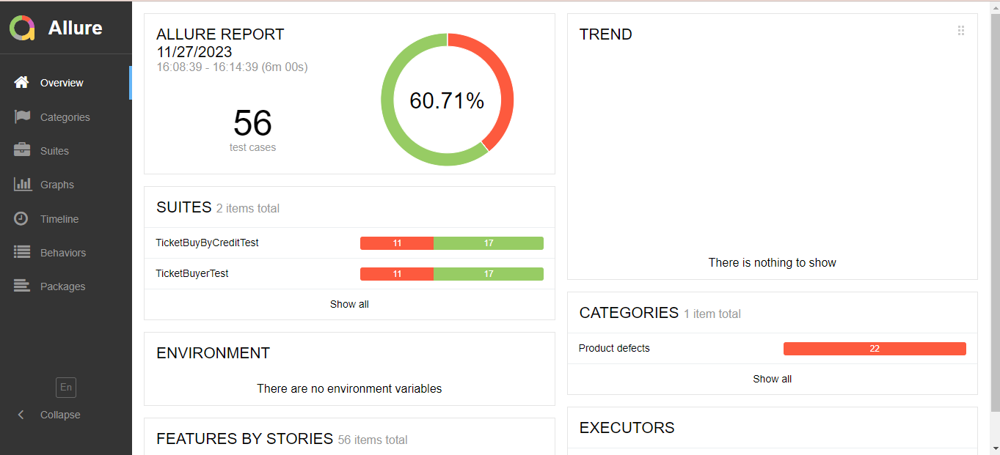
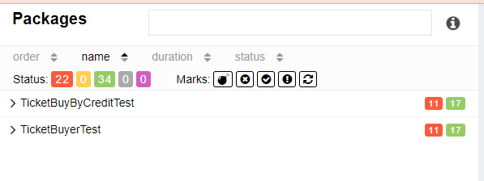
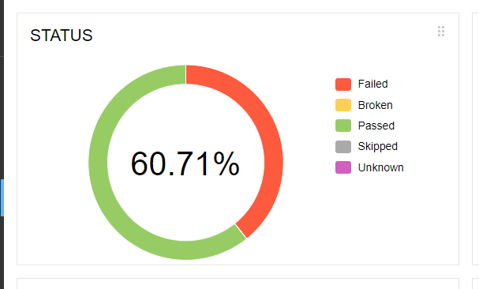
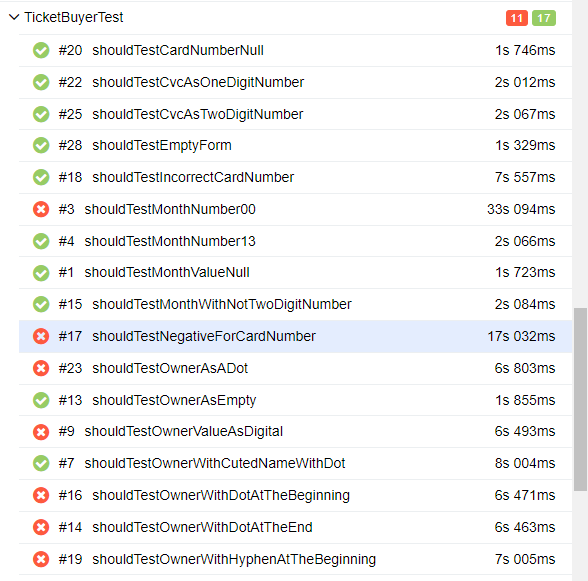

# Отчет о проведенном автоматизированном тестировании формы покупки тура

## Краткое описание
**Цель проекта:**
Автоматизация тестирования веб-формы для покупки туров с использованием языка программирования Java.

**Основные функциональные требования:**
* Загрузка главной страницы веб-приложения.
* Ввод данных в форму покупки тура, таких как номер карты, месяц и год ее валидности, имя владельца карты и CVV код. 
* Проверка правильности введенных данных 
* Оформление заказа и ввод данных для оплаты.
* Подтверждение успешного завершения процесса покупки.
* Обращение в базу данных для получения утверждения принятия или отказа оплаты покупки тура. 

**Особенности реализации:**
* Использование языка Java для написания тестов и вспомогательных классов, таких как DataHelper и SQLHelper
* Использование Selenium WebDriver для взаимодействия с веб-элементами и выполнения действий на странице
* Использование JUnit5 для организации и запуска тестов
* Применение Gradle для управления зависимостями, сборки проекта и запуска тестов

**Отчетность:**
Отчеты о результатах тестирования генерируются с использованием возможностей JUnit5 и Allure и предоставляют подробную информацию о пройденных и проваленных тестах.

Этот проект предоставляет автоматизированное решение для тестирования ключевых сценариев веб-приложения, интеграции с банковской системой оплаты, обеспечивая повышение эффективности и качества разработки.

## Количество тест-кейсов(процент успешных и не успешных тест-кейсов)
Для каждой формы оплаты тура (формы 'Купить' и 'Купить в кредит') было написано по 28 тест-кейсов и авто-тестов соответственно.Были написаны проверки для каждой строки, как позитивные сценарии, так и негативные. В общем счете было написано 56 тест-кейсов.

 Данные тест-кейсы содержат проверки валидации полей, корректное оформление заказа, а также ответ в базе данных со стороны банка, при успешной и не успешной покупке. 
Были протестированы 2 тестовых класса для разных форм покупки. 

Если смотреть процентное соотношение всех выполненных тест-кейсов, то 60.71% были успешными, а у остальных 39.29% был статус failed(провален), после чего были заведены баг-репорты, с указанием не корректной работы системы веб-приложения.

В общем счете, на 2 формы было 22 проваленных тест-кейса и 34 успешных. 

## Общие рекомендации
* Нужно регулярно обновлять автоматизированные тесты в соответствии с изменениями в коде и функциональности. Поддерживать актуальность тестов, чтобы они оставались надежными и информативными
* Использовать параметризацию для управления различными вариантами ввода данных в тест-кейсы. Это сделает тесты более гибкими и обеспечит повторное использование кода
* Регулярно оценивать возможности для расширения тестового покрытия. Добавлять новые тест-кейсы для покрытия дополнительных сценариев использования и обеспечения полноты тестирования
* Поддерживать регулярную генерацию отчетов о результатах тестирования и метрик охвата тестами. Использовать эти отчеты для оценки эффективности тестирования

Эти рекомендации помогут обеспечить эффективное управление и поддержание автоматизированной тестовой инфраструктуры в процессе разработки и поддержки проекта.